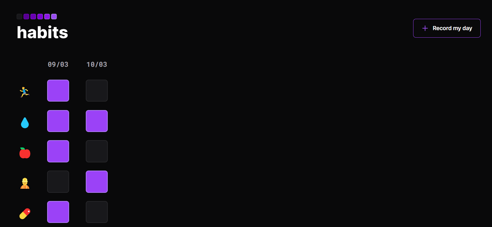

<h1 align="center"> Habits Simple Version </h1>

  <a href="#-tecnologies">Tecnologies</a>&nbsp;&nbsp;&nbsp;|&nbsp;&nbsp;&nbsp;
  <a href="#-project">Project</a>&nbsp;&nbsp;&nbsp;|&nbsp;&nbsp;&nbsp;
  <a href="#-layout">Layout</a>&nbsp;&nbsp;&nbsp;|&nbsp;&nbsp;&nbsp;
  <a href="#license">License</a>

  

 

  

## 🚀 Tecnologies

This project were developed using the follow tecnologies:

- HTML e CSS
- JavaScript
- Git e Github

## 💻 Project

Habits Simple Version is a simple version of a little project developed during a RocketSeat event

- [Acess this online here](https://maykbrito.github.io/devlinks)

## 🔖 Layout

You can see the layout here in [this link](https://www.figma.com/community/file/1187422022288947321).

## :memo: License

This project is licensed under the MIT license.
